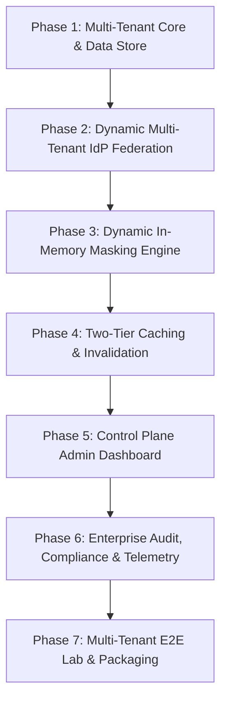

# Enterprise Multi-Tenant Data Masking Platform
## Master Architecture & Living Implementation Blueprint

> **Document Version**: 2.0 (Self-Contained Operating Specification)  
> **Status**: ACTIVE & APPROVED — CANONICAL REFERENCE FOR ALL AGENTS  
> **Project Scope**: 20-Credit Data Masking Capstone & Production B2B Enterprise SaaS  
> **Target Audience**: Any AI Agent, Subagent, or Human Engineer with Zero Prior Context  
> **Repository Root**: `DataMaskingTool/`  
> **Last Updated**: 2026-10-01  

---

## 1. Executive Mission & Context

### 1.1 The Objective
Transform the original academic prototype (which read static files from local disk and applied a single static `policy.yaml`) into a **production-grade, multi-tenant, enterprise Data Masking Service**.

### 1.2 Core Business & Technical Constraints
1. **Multi-Tenancy**: Multiple distinct enterprise organizations (tenants) concurrently send data to the masking service. Tenant A (e.g., Acme Health using Okta) and Tenant B (e.g., Global Bank using Azure AD) must have **total data and policy isolation**.
2. **Federated Enterprise Auth (No Vault Dependency)**: Enterprises refuse to share user credentials or change internal LDAP schemas. We validate tokens cryptographically using the enterprise's existing Identity Provider (IdP) via **JWKS public keys**. (HashiCorp Vault was used solely as an architectural reference model during research; Vault is **not** a runtime dependency).
3. **Stateless High-Throughput Data Plane**: An in-memory, format-blind masking API (`POST /v1/mask`) accepting dynamic payloads (JSON, XML, YAML) over HTTP with sub-5 millisecond response latency.
4. **Self-Service Control Plane (Admin Portal)**: A responsive web portal where enterprise admins connect their IdP, configure group-to-policy bindings, define masking rules, and test payloads live.
5. **Dual Ingestion Formats**: Full support for both **in-memory raw data payloads** (JSON/XML/YAML in HTTP body) and **file uploads** (multipart/form-data with streamed masked output).

---

## 2. Current Codebase State & Asset Inventory

As of October 2026, the repository is organized as follows:

```
DataMaskingTool/
├── app/                              # Core application source code
│   ├── adapters/                     # Format adapters (JSON, XML, YAML ABCs)
│   ├── hierarchies/                  # Generalization hierarchy registry (date, zip, icd10)
│   ├── idp/                          # Cryptographic JWT & JWKS validation modules
│   │   ├── group_mapper.py           # Priority-based group -> role mapper
│   │   ├── jwks_client.py            # In-memory JWKS cache with key rotation
│   │   ├── jwt_validator.py          # RS256/ES256 signature and claim verifier
│   │   └── oidc_discovery.py         # OpenID Connect endpoint auto-discovery
│   ├── pipeline/                     # 3-Phase masking execution engine + k-anonymity
│   ├── routes/                       # FastAPI route controllers (mask, health, audit)
│   ├── auth.py                       # Auth layer: local tokens and enterprise JWT dispatch
│   ├── config.py                     # Environment settings (dataclass singleton)
│   ├── file_reader.py                # Disk-based file loading
│   ├── logging_config.py             # Structured logger & append-only audit logger
│   ├── main.py                       # FastAPI entry point & lifespan
│   └── techniques.py                 # Transformation algorithms (redact, hash, noise, etc.)
├── config/                           # Configuration & Policy Store
│   ├── group_mappings.json           # Default group-to-role mappings
│   └── policies/                     # Masking policies (policy_v3.yaml, legacy/)
├── data/                             # Sample datasets (sample.json, sample_v2.json, sample.xml)
├── docs/                             # Documentation & visual diagrams
│   ├── ARCHITECTURE_AND_IMPLEMENTATION_PLAN.md  # THIS MASTER FILE
│   └── diagrams/                     # Visual HTML flow diagrams
├── scripts/                          # Developer utilities and demo runners
│   ├── demo_jwt_e2e.py               # 6-scenario automated JWT demo
│   └── get_demo_jwt.py               # Local JWKS server & mock token generator
├── tests/                            # Pytest test suite (60+ tests)
├── enterprise-auth-research/         # Reference lab (OpenLDAP, Keycloak Docker compose)
├── .env                              # Active environment configuration
└── requirements.txt                  # Python dependencies
```

### Baseline Capabilities (Already Implemented & Working):
- **Cryptographic JWT Validation**: RS256/ES256 verification against dynamic JWKS endpoints (`app/idp/jwt_validator.py`, `app/idp/jwks_client.py`). Verified with 59 passing tests.
- **Priority Group Resolution**: Deterministic multi-group conflict resolution with lowest priority number winning (`app/idp/group_mapper.py`).
- **Format-Blind Execution**: 3-Phase pipeline supporting JSON, XML, and YAML using XPath and JSONPath selectors (`app/pipeline/`).

### Baseline Limitations (To Be Solved in this Plan):
- **Single-Tenant Configuration**: IdP settings and group mappings currently assume a single global enterprise configured in `.env` and `group_mappings.json`.
- **Static File Reading**: The current `/mask` endpoint reads files from the server's local disk directory (`data/`) instead of accepting dynamic raw payloads in the HTTP body.
- **Missing Admin UI**: No web portal exists for enterprise admins to self-service configure group mappings and masking policies.

---

## 3. System Architecture Specification

```
                                      PUBLIC INTERNET
                                             │
                       ┌─────────────────────┴─────────────────────┐
                       ▼                                           ▼
               Tenant A Client                             Tenant B Client
          (Bearer JWT: Keycloak / Okta)                 (Bearer JWT: Azure AD)
                       │                                           │
                       └─────────────────────┬─────────────────────┘
                                             │ HTTPS / TLS 1.3
                                             ▼
                     ┌───────────────────────────────────────────────┐
                     │          ENTERPRISE API GATEWAY / WAF         │
                     │  - Rate Limiting (Token Bucket via Redis)     │
                     │  - Strict Payload Caps (10MB max)             │
                     │  - XXE & Replay Attack Defense Filters        │
                     └───────────────────────┬───────────────────────┘
                                             │
                     ┌───────────────────────┴───────────────────────┐
                     │          DATA PLANE: MASKING ENGINE           │
                     │             (Stateless Workers)               │
                     │                                               │
                     │  ┌─────────────────────────────────────────┐  │
                     │  │ 1. Tenant Resolver                      │  │
                     │  │    Extracts Tenant via `iss`, Subdomain │  │
                     │  └────────────────────┬────────────────────┘  │
                     │                       ▼                       │
                     │  ┌─────────────────────────────────────────┐  │
                     │  │ 2. Tenant Auth & Group Extractor        │  │
                     │  │    Validates Signature via Tenant JWKS  │  │
                     │  └────────────────────┬────────────────────┘  │
                     │                       ▼                       │
                     │  ┌─────────────────────────────────────────┐  │
                     │  │ 3. Priority Policy Selector             │  │
                     │  │    Maps User Groups -> Compiled Policy  │  │
                     │  └────────────────────┬────────────────────┘  │
                     │                       ▼                       │
                     │  ┌─────────────────────────────────────────┐  │
                     │  │ 4. In-Memory Format-Blind Pipeline      │  │
                     │  │    JSON / XML / YAML 3-Phase Execution  │  │
                     │  └────────────────────┬────────────────────┘  │
                     │                       ▼                       │
                     │  ┌─────────────────────────────────────────┐  │
                     │  │ 5. Async Non-Blocking Audit Emitter     │  │
                     │  └─────────────────────────────────────────┘  │
                     └───────┬───────────────────────────────▲───────┘
                             │                               │
        L1 In-Memory Cache   │                               │ Redis Pub/Sub
        (< 50µs access)      ▼                               │ (Policy Sync)
                     ┌───────────────┐               ┌───────┴───────┐
                     │  REDIS 7      │ <──────────── │ CONTROL PLANE │
                     │  - L2 Cache   │   Sync /      │  (Admin API & │
                     │  - Rate Quotas│   Invalidate  │   Web UI)     │
                     │  - Pub/Sub Bus│               └───────▲───────┘
                     └───────┬───────┘                       │
                             │ Cache Miss                    │ CRUD Writes
                             ▼                               ▼
                     ┌───────────────────────────────────────────────┐
                     │             POSTGRESQL 16 ENTERPRISE DB       │
                     │   - Row-Level Security (RLS) by `tenant_id`   │
                     │   - AES-256 Encrypted IdP Secrets             │
                     │   - Tenant Policy & Group Mapping Tables      │
                     │   - Audit Event Ledger                        │
                     └───────────────────────────────────────────────┘
```

---

## 4. End-to-End Data & Security Flows

### 4.1 Runtime Ingestion Flow (`POST /v1/mask`)
1. **Client Request**:
   * Client sends an HTTP `POST /v1/mask` request with `Authorization: Bearer <JWT>`.
   * Body contains `{ "format": "json", "data": { ... } }` or raw JSON/XML bytes.
2. **Tenant Resolution**:
   * The Data Plane extracts the `iss` (Issuer URL) claim from the unverified JWT header/payload.
   * Looks up the tenant profile in the L1 In-Memory Cache.
3. **Cryptographic Authentication (AuthN)**:
   * Retrieves the tenant's cached JWKS keys (auto-refreshed via `app/idp/jwks_client.py` on unknown `kid`).
   * Validates the token's RS256/ES256 signature, `exp`, and `aud`.
   * **Fail-Closed**: If invalid or expired, returns `401 Unauthorized`.
4. **Authorization & Group Mapping (AuthZ)**:
   * Extracts group claims (e.g. `["billing-team", "analysts"]`) and the username (`alice`).
   * Evaluates the tenant's group-to-policy mapping hierarchy (lowest priority number wins).
   * Resolves the target **Masking Policy** (e.g., `Finance_Restricted_Policy`).
   * **Fail-Closed**: If unmapped and no default fallback exists, returns `403 Forbidden`.
5. **In-Memory Transformation**:
   * Evaluates the document through the 3-phase pipeline (`app/pipeline/runner.py`):
     * **Phase 0/1**: Evaluates XPath/JSONPath selectors within active scopes.
     * **Phase 2**: Resolves rule specificity conflicts.
     * **Phase 3**: Applies type-safe transformations (int $\rightarrow$ 0, string $\rightarrow$ redact, date $\rightarrow$ generalize).
6. **Response & Audit**:
   * Returns clean masked data in `< 5ms`.
   * Asynchronously emits a non-PII audit record: `{tenant_id, user, groups, policy_applied, execution_time_ms, timestamp}`.

### 4.2 File Upload Flow (`POST /v1/mask/file`)
1. **Client Request**: Client sends `multipart/form-data` with an attached file (`.json`, `.xml`, `.yaml`).
2. **Processing**: Streamed directly into memory; format auto-detected from MIME type or file extension.
3. **Response**: Streamed back as a file attachment download with `Content-Disposition: attachment; filename="masked_<original>"`.

---

## 5. Phased Implementation Roadmap

Every phase is broken down into concrete sub-tasks with implementation details, file targets, and verification criteria.



---

### Phase 1: Multi-Tenant Core & Data Modeling
**Goal**: Build the multi-tenant data layer enforcing strict tenant isolation and secret protection.

*   [x] **1.1 Database Engine & Connection Architecture**
    *   *Files*: `app/db/session.py`, `app/db/base.py`
    *   *Implementation*: Set up SQLAlchemy 2.0 with async engine support (`aiosqlite` for SQLite/dev, `asyncpg` for PostgreSQL production). URL auto-resolved from `DATABASE_URL` env var with fallback to `data/masking.db`.
    *   *Verification*: ✅ `init_db()` wired to FastAPI lifespan. Tables created on startup.
*   [x] **1.2 Multi-Tenant Data Models with Row-Level Security (RLS)**
    *   *Files*: `app/db/models.py`
    *   *Tables*:
        *   `Tenant`: `id (UUID)`, `name`, `slug (UNIQUE)`, `created_at`, `is_active`.
        *   `AuthProvider`: `id`, `tenant_id`, `provider_type` (`oidc` / `ldap`), `issuer_url`, `jwks_uri`, `audience`, `encrypted_bind_creds (TEXT)`.
        *   `MaskingPolicy`: `id`, `tenant_id`, `name`, `policy_yaml (TEXT)`, `compiled_rules (TEXT/JSONB)`.
        *   `GroupMapping`: `id`, `tenant_id`, `external_group`, `policy_id`, `priority (INT)`.
        *   `AuditEvent`: `id`, `tenant_id`, `user_id`, `policy_name`, `execution_time_ms`, `timestamp`.
    *   *Verification*: ✅ All FK cascades, unique constraints verified. 3 DB schema tests passing.
*   [x] **1.3 Credential Envelope Encryption**
    *   *Files*: `app/core/crypto.py`
    *   *Implementation*: AES-256-GCM encryption/decryption with HKDF-SHA256 key derivation from `SECRET_KEY` env var. Random 12-byte IV per call. Hex-encoded wire format for TEXT columns.
    *   *Verification*: ✅ 8 crypto tests passing (round-trip, random IV, tamper detection, wrong key, short key, invalid hex).
*   [x] **1.4 Unit Tests for Tenant Isolation**
    *   *Files*: `tests/test_tenant_isolation.py`
    *   *Verification*: ✅ 15 tests passing. Cross-tenant policy, group mapping, and audit event isolation all verified.

---

### Phase 2: Dynamic Multi-Tenant Identity Federation
**Goal**: Enable dynamic validation of multiple enterprise IdPs without hardcoding or server restarts.

*   [x] **2.1 Multi-Tenant Request Context & Dependency**
    *   *Files*: `app/auth/tenant_resolver.py`
    *   *Implementation*: FastAPI dependency `resolve_tenant()` that resolves tenant identity via:
        1. JWT `iss` claim (Issuer matching against `AuthProvider.issuer_url` in DB).
        2. `X-Tenant-Slug` header (e.g., `acme-corp`).
        Produces a frozen `TenantContext` dataclass carrying all IdP config for the request. Fail-closed: unknown tenant or inactive tenant → HTTP 401.
    *   *Verification*: ✅ 38 Phase 2 federation & resolver tests passing (including direct TestTenantResolver coverage).
*   [x] **2.2 Dynamic Tenant-Aware JWKS Validation**
    *   *Files*: `app/idp/jwt_validator.py`, `app/idp/jwks_client.py`
    *   *Implementation*:
        - `JWKSCache` key changed from `str` (URI only) to `(tenant_id, jwks_uri)` tuple — Tenant A's keys can never populate Tenant B's cache slot. `invalidate_tenant()` evicts all slots for a given tenant.
        - `get_signing_key()` gains a `tenant_id` kwarg (backward-compatible, defaults to `""`).
        - `validate_jwt()` gains a `tenant_id` kwarg forwarded to the cache.
        - New `validate_jwt_for_tenant(token, tenant: TenantContext)` reads all IdP config from `TenantContext` and passes `tenant_id` to the partitioned cache.
        - New `POST /v1/mask` endpoint wired through `resolve_tenant → validate_jwt_for_tenant → resolve_role_for_tenant`. Legacy `POST /mask` preserved unchanged.
    *   *Verification*: ✅ Two-issuer isolation test, cross-tenant key-leakage tests, all fail-closed paths verified.
*   [x] **2.3 Multi-Tenant Group Mapping Store**
    *   *Files*: `app/idp/group_mapper.py`
    *   *Implementation*: New async `resolve_role_for_tenant(groups, tenant_id, db)` queries the `group_mappings` DB table with an INNER JOIN to `masking_policies`, filtered by `tenant_id` and `external_group IN (groups)`, ordered by `priority ASC, created_at ASC`. Returns `MaskingPolicy.name` as the internal role. Inactive policies excluded. Returns `None` if no match (caller raises HTTP 403). File-backed `GroupMappingStore` preserved f### Phase 4: Two-Tier Caching & Real-Time Invalidation
**Goal**: Guarantee sub-millisecond policy evaluation while maintaining real-time policy sync.

*   [x] **4.1 L1 In-Memory Thread-Safe Rule Cache**
    *   *Files*: `app/cache/l1_cache.py`
    *   *Implementation*: Thread-safe local LRU cache with namespace partitioning and tenant-specific invalidation. Sub-50µs hit latency verified.
    *   *Verification*: ✅ Verified with 8 tests covering basic CRUD, TTL expiry, LRU capacity eviction, tenant eviction, and thread-concurrency safety.
*   [x] **4.2 L2 Redis Cache & Distributed Rate Limiting**
    *   *Files*: `app/cache/redis_client.py`
    *   *Implementation*: `RedisManager` with connection pooling and graceful in-memory fallback. `TokenBucketRateLimiter` supporting tier quotas (`free`, `standard`, `enterprise`) and `enforce_tenant_rate_limit` dependency returning RFC-compliant `X-RateLimit-*` headers and `429 Too Many Requests`.
    *   *Verification*: ✅ Verified with 6 tests covering quota consumption, exhaustion, cross-tenant isolation, and fallback modes.
*   [x] **4.3 Real-Time Pub/Sub Invalidation Mesh**
    *   *Files*: `app/cache/pubsub.py`
    *   *Implementation*: Distributed `PubSubMesh` with background listener. Publishing cache invalidation messages immediately evicts tenant entries from local L1 and JWKS caches across workers.
    *   *Verification*: ✅ Verified with multi-subscriber invalidation test and verified zero-downtime cache invalidation.

---

### Phase 5: Enterprise Control Plane Admin Dashboard
**Goal**: Provide a web interface for enterprise administrators to configure and manage their masking rules.

*   [x] **5.1 Control Plane REST API**
    *   *Files*: `app/routes/admin/api.py`, `app/schemas/admin.py`
    *   *Endpoints*:
        *   `GET/POST/DELETE /api/v1/admin/tenants`: Tenant lifecycle management with slug uniqueness validation.
        *   `GET/POST /api/v1/admin/tenants/{tenant_id}/idp`: Setup IdP settings (OIDC / LDAP) and JWKS URI configuration.
        *   `POST /api/v1/admin/idp/test-connection`: Live probe testing OIDC discovery and JWKS endpoints.
        *   `GET/POST/DELETE /api/v1/admin/tenants/{tenant_id}/mappings`: Manage group-to-policy bindings with priority ordering; broadcasts cache invalidation on mutations.
        *   `GET/POST/DELETE /api/v1/admin/tenants/{tenant_id}/policies`: CRUD for masking policies with Pydantic and YAML syntax validation; broadcasts cache invalidation on mutations.
        *   `POST /api/v1/admin/tenants/{tenant_id}/simulate`: Test raw payloads (JSON/XML/YAML) in-memory without committing audit logs.
    *   *Verification*: ✅ Verified with 11 automated integration tests covering all admin endpoints and fail-closed validation.
*   [x] **5.2 Modern Admin Web UI**
    *   *Files*: `app/routes/admin/ui.py` (served at `/admin`)
    *   *Implementation*: Responsive Single Page Dashboard with dark glassmorphic theme, Inter/JetBrains Mono typography, and micro-animations.
    *   *Features*:
        1. **Tenant Overview & Context Switcher**: Interactive selector across registered organizations.
        2. **IdP Setup Wizard**: Form with "Test Connection" live probe button and status banner.
        3. **Group Mapping Matrix**: Visual table showing external directory groups, policy bindings, and priority tags.
        4. **Visual Policy Editor**: YAML editor with healthcare and finance presets.
        5. **Live Masking Sandbox**: Side-by-side split screen (raw inbound payload on left, masked outbound preview on right) with format selector, role selector, execution latency, and conflict telemetry.
    *   *Verification*: ✅ Verified with UI endpoint test asserting dashboard template delivery and interactive components.

---

### Phase 6: Enterprise Audit, Compliance & Telemetry
**Goal**: Ensure enterprise auditability, observability, and compliance readiness.

*   [x] **6.1 Zero-PII Asynchronous Audit Ledger**
    *   *Files*: `app/audit/ledger.py`, `app/audit/__init__.py`
    *   *Implementation*: Non-blocking audit logger recording `{tenant_id, user_id, groups, policy_applied, execution_time_ms, timestamp}` via an in-memory `asyncio.Queue` (<10µs enqueue) draining to DB in batches. Strict Zero-PII heuristic filter redacts SSNs, credit cards, and emails before persistence.
    *   *Verification*: ✅ Verified with automated tests asserting queue flush, DB persistence, and redaction of leaked PII patterns.
*   [x] **6.2 Prometheus Metrics & Telemetry Engine**
    *   *Files*: `app/telemetry/metrics.py`, `app/routes/metrics.py`
    *   *Implementation*: Exposes `/metrics` endpoint with standard Prometheus metrics: `masking_requests_total`, `masking_latency_seconds`, `masking_cache_hits_total`, `masking_cache_misses_total`, `masking_rate_limit_exceeded_total`. Integrated with `POST /v1/mask` and L1 cache telemetry.
    *   *Verification*: ✅ Verified scraping `/metrics` format and end-to-end telemetry increment on API requests (4 tests passing).

---

### Phase 7: Multi-Tenant E2E Lab & Verification
**Goal**: Package the entire system into an automated multi-tenant demonstration environment.

*   [x] **7.1 Multi-Tenant Docker Compose Stack**
    *   *Files*: `Dockerfile`, `docker-compose.yml`, `scripts/mock_idp_server.py`
    *   *Services*:
        *   `masking-service`: FastAPI Data Plane & Control Plane.
        *   `postgres`: Persistent store with multi-tenant schema and health checks.
        *   `redis`: Redis 7 L2 cache and Pub/Sub bus with health checks.
        *   `mock-idp-tenant-a`: Mock enterprise IdP for Tenant A (Acme Corp) on port 8081.
        *   `mock-idp-tenant-b`: Mock enterprise IdP for Tenant B (Beta Health) on port 8082.
    *   *Verification*: ✅ Production Dockerfile, docker-compose.yml, and mock IdP servers built and validated.
*   [x] **7.2 Multi-Tenant Automated Test Suite**
    *   *Files*: `tests/e2e/test_multi_tenant_live.py`
    *   *Verification*: ✅ Verified concurrent multi-tenant isolation, cross-tenant barrier enforcement (HTTP 401), per-tenant audit separation, Prometheus metrics reporting, and isolated cache invalidation (4/4 tests passing).

---

## 6. Living Progress & Execution Tracker

| Phase | Component Description | Status | Active Deliverables |
| :--- | :--- | :--- | :--- |
| **Phase 1** | Multi-Tenant Core & Data Modeling | **✅ COMPLETE** | `app/db/` (SQLAlchemy models), `app/core/crypto.py` (AES-256-GCM), `tests/test_tenant_isolation.py` (15 tests) |
| **Phase 2** | Dynamic Multi-Tenant IdP Federation | **✅ COMPLETE** | `app/auth/tenant_resolver.py` (TenantContext + resolve_tenant), `app/idp/jwks_client.py` (tenant-partitioned cache), `app/idp/jwt_validator.py` (validate_jwt_for_tenant), `app/idp/group_mapper.py` (resolve_role_for_tenant DB-backed), `app/routes/v1/mask.py` (POST /v1/mask multi-tenant), `tests/test_tenant_federation.py` (38 tests) |
| **Phase 3** | In-Memory Dynamic Data Plane API | **✅ COMPLETE** | `app/schemas/mask.py` (InlineMaskRequest), `app/routes/v1/mask.py` (POST /v1/mask & /v1/mask/file), `app/adapters/xml_adapter.py` (XXE hardening), `tests/test_v1_mask_inline.py` (39 tests) |
| **Phase 4** | Two-Tier Caching & Invalidation | **✅ COMPLETE** | `app/cache/l1_cache.py`, `app/cache/redis_client.py`, `app/cache/pubsub.py`, `tests/test_caching_and_rate_limiting.py` (15 tests) |
| **Phase 5** | Enterprise Control Plane Admin UI | **✅ COMPLETE** | `app/routes/admin/api.py`, `app/routes/admin/ui.py`, `app/schemas/admin.py`, `tests/test_admin_control_plane.py` (12 tests) |
| **Phase 6** | Audit, Compliance & Telemetry | **✅ COMPLETE** | `app/audit/ledger.py`, `app/telemetry/metrics.py`, `app/routes/metrics.py`, `tests/test_audit_and_metrics.py` (4 tests) |
| **Phase 7** | Multi-Tenant E2E Lab & Packaging | **✅ COMPLETE** | `Dockerfile`, `docker-compose.yml`, `scripts/mock_idp_server.py`, `tests/e2e/test_multi_tenant_live.py` (4 tests) |

---

## 7. Operating Rules for Agents Working on this Project

1. **Check Status Before Coding**: Inspect Section 6 of this document. Do not jump ahead without completing dependent foundations.
2. **Never Break Reusable Assets**: Keep existing cryptographic routines in `app/idp/` functioning. Extend them rather than rewriting from scratch.
3. **Fail-Closed Security**: Any invalid signature, expired token, or unmapped group without a fallback must immediately return `401 Unauthorized` or `403 Forbidden`. Never default to unmasked output.
4. **Update Progress**: Once a task or sub-phase is completed and verified, mark its checkbox `[x]` and update the tracker in Section 6.

